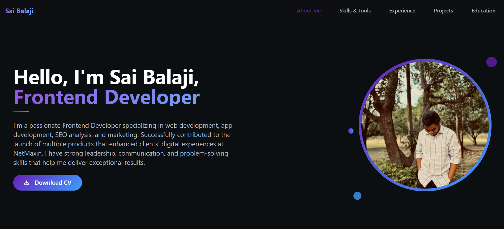

# Balu Portfolio - React Personal Portfolio

A modern personal portfolio website built with React, TypeScript, and Tailwind CSS. Showcases professional skills, projects, education, and contact information.



## Features
- Responsive design with mobile-first approach
- Interactive project showcase with images
- Skills section with proficiency indicators
- Contact form functionality
- Dark/light mode support
- PDF resume download

## Technologies
- ⚛️ React 18
- 📜 TypeScript
- 🎨 Tailwind CSS
- ⚡ Vite
- 🔧 Shadcn UI Components
- 📄 React PDF Viewer

## Installation
1. Clone the repository:
   ```bash
   git clone https://github.com/yourusername/balu-portfolio.git
   ```
2. Install dependencies:
   ```bash
   npm install
   ```
3. Start development server:
   ```bash
   npm run dev
   ```
4. Open in browser: `http://localhost:5173`

## Project Structure
```
src/
├── components/       # Reusable components
│   ├── About.tsx
│   ├── Contact.tsx
│   ├── Education.tsx
│   ├── Hero.tsx
│   ├── Projects.tsx
│   ├── Skills.tsx
│   └── ui/           # Shadcn UI components
├── assets/           # Images and PDFs
├── hooks/            # Custom hooks
├── lib/              # Utility functions
├── pages/            # Page components
├── App.tsx           # Main application
└── main.tsx          # Entry point
```

## Available Scripts
- `dev`: Start development server
- `build`: Create production build
- `preview`: Preview production build
- `lint`: Run ESLint
- `format`: Format with Prettier

## Configuration
Edit `tailwind.config.ts` for styling customization or `vite.config.ts` for build settings.

## License
MIT License - see [LICENSE](LICENSE) for details.